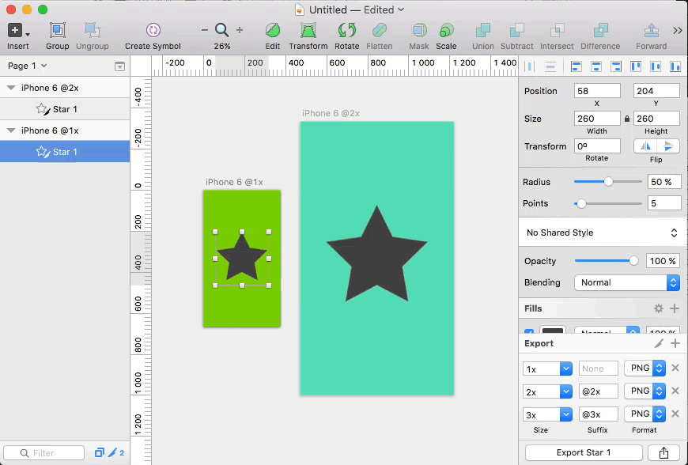

# Scaled Export for iOS

Sketch plugin, which makes assets exportable for iOS project depending on original Sketch project scale.

## How to install

1. Download **ScaledExport.sketchplugin**
2. Open **Sketch.app**
3. Open from menu **Plugins -> Manage Plugins...**
4. Press on **Gear button** and select **Show Plugins Folder**
5. Copy **ScaledExport.sketchplugin** to opened folder

## How to use

Select layers you want to make exportable and use one of these shortcuts:

* `^ 1` - makes selected layers exportable with options: 
	* scale: [x1] suffix: [ ]
	* scale: [x2] suffix: [@2x]
	* scale: [x3] suffix: [@3x]
* `^ 2` - makes selected layers exportable with options:
 	* scale: [x0.5] suffix: [ ]
	* scale: [x1] suffix: [@2x]
	* scale: [x1.5] suffix: [@3x]
* `^ 3` - makes selected layers exportable with options:
	* scale: [x0.33] suffix: [ ]
	* scale: [x0.67] suffix: [@2x]
	* scale: [x1] suffix: [@3x]
* `^ 4` - tries to calculate scale from artboard size and make layer exportable with corresponding options